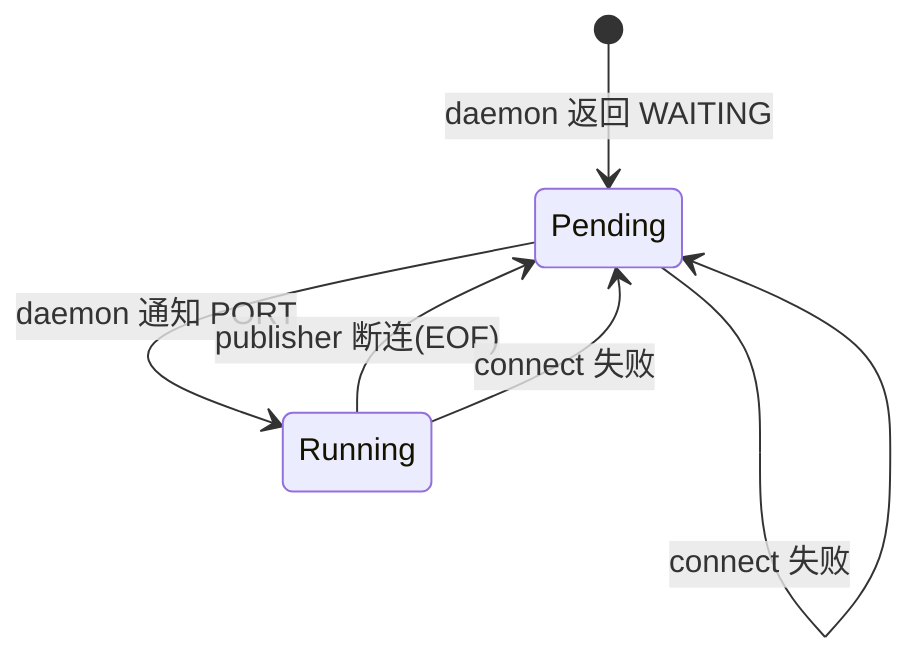

# MiniIPC

轻量级进程间通信（IPC）框架，基于 TCP 的发布-订阅（Pub/Sub）模式，附带 Web 调试面板。

## 技术栈

| 层 | 语言/构建 | 关键依赖 |
|---|-----------|----------|
| Core | C++17, CMake + Ninja | epoll, POSIX sockets, yaml-cpp |
| Bridge | C++17, Boost.Beast | nlohmann/json |
| Dashboard | Vue 3, TypeScript, Vite 6 | — |

## 架构

```
Dashboard (Vue 3) ←──WebSocket──→ Bridge (C++) ←──Core API──→ Discovery Daemon (C++)
                                      │                              │
                              Core libmini_ipc_core.so ←─────────────┘
                                      │
                              ┌───────┴───────┐
                          Publisher      Subscriber
                         (TCP server)   (TCP client)
                              │               │
                              └─── P2P TCP ───┘
```

## 快速开始

### 构建

```bash
cmake -B build -G Ninja && cmake --build build
```

### 运行示例

```bash
# 终端 1: 启动发现服务
./build/core/examples/discovery_daemon

# 终端 2: 启动订阅者
./build/core/examples/listener

# 终端 3: 启动发布者
./build/core/examples/talker

# 终端 4: 启动 Bridge（Dashboard 通信需要）
./build/bridge/mini_ipc_bridge
```

### 启动 Dashboard

```bash
cd dashboard && npm install && npm run dev
```

访问 `http://127.0.0.1:5173`，连接到 `ws://127.0.0.1:9000`。

## 核心设计

### Node（事件循环核心）

单一 epoll 实例管理三种 fd，对应两类 subscriber 状态：

| 状态 | 结构体 | 管理 fd 类型 |
|------|--------|--------------|
| Running | `SubInfo {topic, callback, read_buffer}` | Publisher 直连 client_fd |
| Pending | `PendingSubInfo {topic, callback}` | Daemon 等待连接 sc_fd |



### Discovery Daemon（发现与注册中心）

```cpp
struct TopicEntry {
    std::string port;
    bool port_available;       // publisher 是否在线
    int publisher_fd;          // publisher 长连接（监控存活）
    std::vector<int> waiting_fds; // 等待通知的 subscriber
};
```

- Publisher 通过长连接注册，daemon 通过检测 EOF 感知下线
- Subscriber 查询时：publisher 在线则返回端口；否则加入 waiting 等待通知
- Publisher 上线时通知所有 waiting 中的 subscriber

### 通信协议

| 通道 | 协议 | 帧格式 |
|------|------|--------|
| Pub/Sub 数据 | TCP 直连 | 4 字节大端长度 + payload（writev / 缓冲区拼帧） |
| Daemon 注册/发现 | TCP | 文本命令：PUB / SUB / OK / WAITING / PORT |
| Bridge ↔ Dashboard | WebSocket | JSON：`{type, topic, payload, level, message}` |

### Bridge 跨线程通信

```
epoll 线程 (Node::spin)              io_context 线程 (Boost.Asio)
─────────────────────                ─────────────────────────
subscriber_callback(msg)             
  → boost::asio::post(ioc_, ...) ──→ lambda 执行
                                      → session->send_message(json)
                                        → write_queue → async_write → Dashboard
```

Subscriber 回调在 epoll 线程触发，通过 `boost::asio::post` 投递到 io_context 线程安全写 WebSocket。

## 已实现功能

| 功能 | 说明 |
|------|------|
| Pub/Sub 基础通信 | Publisher 创建 TCP server，Subscriber 直连 |
| Discovery 注册中心 | 支持 PUB/SUB/WAITING/PORT，publisher 存活监控 |
| TCP 帧协议 | writev 写入，缓冲区拼帧读取，解决粘包拆包 |
| 断连重订阅 | Subscriber 检测 EOF 后自动查询 daemon 重连 |
| connect 失败 fallback | 三处 connect 失败均回退到 pending 等待 |
| SIGPIPE 处理 | Publisher 安全处理 subscriber 掉线（SIG_IGN） |
| Bridge 双向通路 | publish 和 subscribe 均完整实现 |
| Dashboard | 连接 / 订阅 / 发布 / 消息列表 / 日志面板，支持深色/浅色主题 |
| CI | GitHub Actions 构建 + 冒烟测试 |

## 已知问题

| 优先级 | 位置 | 问题 |
|--------|------|------|
| 中 | daemon | publisher_fd 掉线时未清理 epoll DEL/close，仅标记 port_available=false |
| 中 | daemon | 旧 publisher_fd 被新注册覆盖时未清理，导致 epoll 残留 |
| 低 | daemon | 文本协议无帧定界 |
| 低 | bridge | session 断开时 subscribers_ 中的对应 entry 未清理 |
| 低 | node.cpp | `events` 数组使用 VLA（非标准 C++） |

## 下一步优化方向

| 方向 | 说明 | 工作量 |
|------|------|--------|
| **Daemon epoll 清理** | publisher_fd 掉线或覆盖时清理 DELL/close | 小 |
| **Daemon 协议帧化** | 统一加长度前缀，消除短消息拆包隐患 | 中 |
| **Bridge unsubscribe** | 支持 Dashboard 取消订阅，清理 subscribers_ | 小 |
| **Session 断连清理** | 客户端断开时清理 BridgeDispatcher 中的 Subscriber 缓存 | 小 |
| **单元测试** | 引入 Google Test，覆盖 ParamManager、帧解析、状态机 | 中 |
| **Core VLA 修复** | `epoll_wait` events 改用 `std::vector` | 小 |
| **Bridge 重构** | `reading_`/`writing_` 状态机可改用 `strand` 标准化 | 中 |

## 文件结构

```
mini-ipc/
├── CMakeLists.txt
├── README.md
├── .github/workflows/ci.yml
├── core/
│   ├── CMakeLists.txt
│   ├── include/mini_ipc/
│   │   ├── node.hpp
│   │   ├── publisher.hpp
│   │   ├── subscriber.hpp
│   │   └── param_manager.hpp
│   ├── src/
│   │   ├── node.cpp
│   │   └── param_manager.cpp
│   ├── config/comm.yaml
│   └── examples/
│       ├── discovery_daemon.cpp
│       ├── talker.cpp
│       └── listener.cpp
├── bridge/
│   ├── CMakeLists.txt
│   ├── include/mini_ipc/
│   │   ├── bridge_dispatcher.hpp
│   │   ├── websocket_server.hpp
│   │   └── websocket_session.hpp
│   └── src/
│       ├── main.cpp
│       ├── bridge_dispatcher.cpp
│       ├── websocket_server.cpp
│       └── websocket_session.cpp
└── dashboard/
    ├── package.json
    ├── vite.config.ts
    ├── src/
    │   ├── App.vue
    │   ├── main.ts
    │   ├── styles.css
    │   └── api/wsClient.ts
    └── index.html
```
